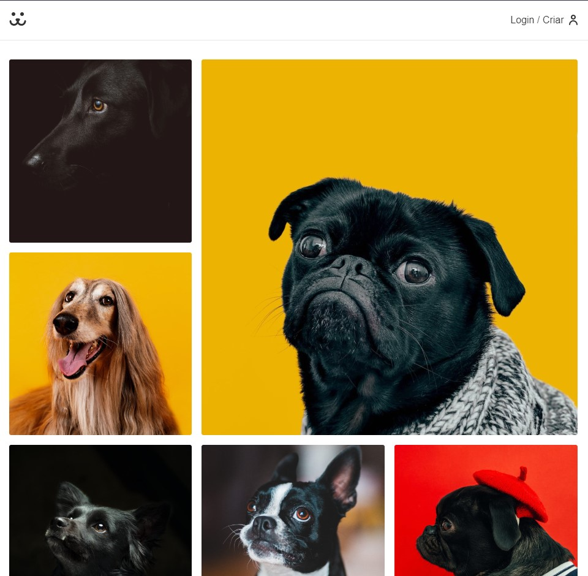

# [Dogs](https://whoisangelo.github.io/dogs-react)

<h1>
    
</h1>

## :memo: Sobre

O projeto **Dogs** é um website que foi criado dentro do curso **React Completo** da [Origamid](https://www.origamid.com/curso/react-completo/) com o intuito de botarmos em prática todo conteúdo estudado durante as aulas.

---

## :rocket: Tecnologias Utilizadas

O projeto foi desenvolvido utilizando as seguintes tecnologias:

- HTML5
- CSS3
- JAVASCRIPT
- REACTJS
